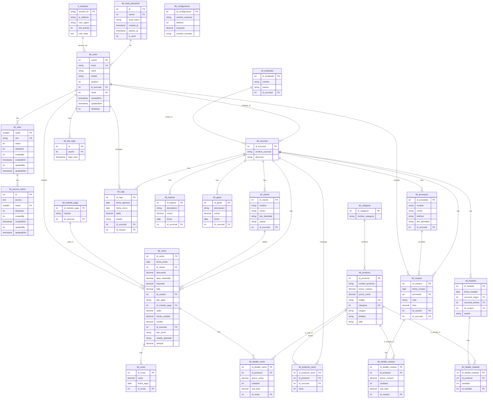

# Diagrama Entidad-Relación (E-R) - POS Multisucursal

## Diagrama Mermaid



---

## Leyenda de Símbolos

- **PK**: Primary Key (Clave Primaria)
- **FK**: Foreign Key (Clave Foránea)
- **UK**: Unique Key (Clave Única)
- **||--o{**: Relación uno-a-muchos (1:N)
- **||--||**: Relación uno-a-uno (1:1)

---

## Tablas Principales por Módulo

### 🔐 Autenticación y Administración
- `tbl_users` - Usuarios del sistema
- `tbl_roles` - Roles y permisos
- `tbl_access_matrix` - Matriz de acceso por rol
- `tbl_last_login` - Historial de login
- `tbl_reset_password` - Reset de contraseñas

### 🏪 Catálogos Maestros
- `tbl_sucursal` - Sucursales/tiendas
- `tbl_producto` - Catálogo de productos
- `tbl_categoria` - Categorías de productos
- `tbl_cliente` - Clientes
- `tbl_proveedor` - Proveedores
- `tbl_metodo_pago` - Métodos de pago
- `tbl_empleado` - Empleados
- `tbl_configuracion` - Configuración del sistema

### 📊 Inventario
- `tbl_producto_stock` - Stock por sucursal
- `tbl_traslado` - Traslados entre sucursales
- `tbl_detalle_traslado` - Detalles de traslados

### 💰 Ventas
- `tbl_venta` - Registro de ventas
- `tbl_detalle_venta` - Detalles de ventas
- `tbl_cuota` - Cuotas para crédito

### 🛒 Compras
- `tbl_compra` - Registro de compras
- `tbl_detalle_compra` - Detalles de compras

### 💳 Caja
- `tbl_caja` - Cajas abiertas/cerradas
- `tbl_ingreso` - Ingresos adicionales
- `tbl_gasto` - Gastos operacionales

### 🔧 Sistema
- `ci_sessions` - Sesiones CodeIgniter

---

## Relaciones Críticas

### Relaciones de Sucursal (Multisucursal)
```
tbl_sucursal
├── tbl_cliente (clientes por sucursal)
├── tbl_proveedor (proveedores por sucursal)
├── tbl_venta (ventas por sucursal)
├── tbl_compra (compras por sucursal)
├── tbl_producto_stock (stock por sucursal)
├── tbl_caja (cajas por sucursal)
├── tbl_ingreso (ingresos por sucursal)
├── tbl_gasto (gastos por sucursal)
└── tbl_traslado (traslados entre sucursales)
```

### Relaciones de Venta
```
tbl_venta
├── tbl_cliente (quién compra)
├── tbl_users (quién vende)
├── tbl_metodo_pago (cómo paga)
├── tbl_detalle_venta (qué compra)
│   └── tbl_producto (productos)
└── tbl_cuota (si es crédito)
```

### Relaciones de Compra
```
tbl_compra
├── tbl_proveedor (de quién compra)
├── tbl_users (quién compra)
├── tbl_detalle_compra (qué compra)
│   └── tbl_producto (productos)
└── tbl_producto_stock (actualiza stock)
```

### Relaciones de Traslado
```
tbl_traslado
├── tbl_sucursal (origen y destino)
├── tbl_users (quién traslada)
└── tbl_detalle_traslado (qué traslada)
    └── tbl_producto (productos)
```

---

## Tipos de Datos Utilizados

### Numéricos
- `INT(11)` - Números enteros estándar
- `SMALLINT(6)` - Números enteros pequeños (para roles: -32,768 a 32,767)
- `DECIMAL(10,2)` - Números decimales precisos para moneda (hasta 99,999,999.99)

### Texto
- `VARCHAR(50)` - Textos cortos (códigos, estados)
- `VARCHAR(200)` - Textos medianos (nombres, direcciones)
- `VARCHAR(400)` - Textos largos (notas)
- `TEXT` - Textos muy largos (JSON de permisos)

### Fechas
- `DATE` - Fechas sin hora
- `DATETIME` - Fechas con hora

### Otros
- `TINYINT(4)` - Booleano (0/1)

---

## Convenciones de Nomenclatura

### Tablas
- Prefijo: `tbl_`
- Nombres en snake_case
- Nombres en singular
- Ejemplo: `tbl_producto`, `tbl_venta`

### Columnas
- PK (Primary Key): `id_nombre_tabla` o `nombre_tableId`
- FK (Foreign Key): `id_nombre_tabla_referenciada`
- Estados: `estado`, `status`, `isDeleted`
- Fechas: `fecha_accion`, `createdDtm`, `updatedDtm`
- Booleanos: `is_*` o `isDeleted`

### Índices
- PK: PRIMARY KEY
- UK: UNIQUE KEY (únicas sin valores NULL duplicados)
- FK: Se sugiere agregar
- Búsquedas frecuentes: Se sugiere agregar

---

## Cardinalidad de Relaciones

| Relación | Tipo | Ejemplo |
|----------|------|---------|
| Usuario → Rol | 1:1 | Un usuario tiene un rol |
| Rol → Acceso | 1:N | Un rol tiene múltiples permisos |
| Sucursal → Cliente | 1:N | Una sucursal tiene múltiples clientes |
| Sucursal → Stock | 1:N | Una sucursal tiene múltiple stock |
| Producto → Detalle Venta | 1:N | Un producto en múltiples ventas |
| Venta → Detalle Venta | 1:N | Una venta tiene múltiples productos |
| Venta → Cuota | 1:N | Una venta puede tener múltiples cuotas |
| Sucursal → Traslado | 1:N | Una sucursal participa en múltiples traslados |

---

## Notas Importantes

1. **No hay FK constraints explícitos declarados** - Se recomienda agregarlos en futuras versiones
2. **JSON en access_matrix** - Se recomienda normalizar a tabla `tbl_role_permissions`
3. **Float en tbl_caja.saldo** - Se recomienda cambiar a DECIMAL(10,2)
4. **sin único en tbl_producto_stock** - Se agregó índice UNIQUE en la corrección actual
5. **Multisucursal por id_sucursal** - Presente en casi todas las tablas operacionales

---

Fecha de Actualización: 26 de Abril de 2026
